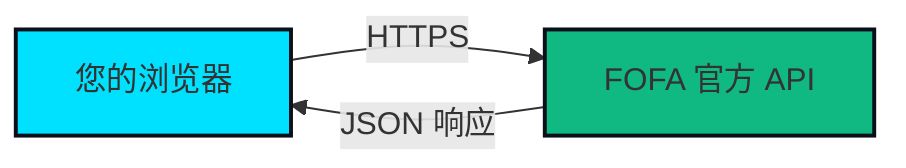

<div align="center">

# 🔍 Fofax

### *A Modern, Privacy-First FOFA Client*

**优雅 · 安全 · 开源**

<p align="center">
  
  
  
  
  
</p>

---

**[在线体验](#) · [快速开始](#-快速开始) · [功能特性](#-核心特性) · [技术架构](#-技术栈)**

</div>

---

## 📖 关于 Fofax

> **Fofax** 是为网络安全从业者和研究人员打造的现代化 FOFA 第三方客户端。

如果你热爱 [FOFA](https://fofa.info) 强大的网络空间测绘能力，却又渴望一个**更美观**、**更流畅**、**更注重隐私**的操作界面，那么 Fofax 正是为你而生。

### 💡 为什么选择 Fofax？

<table>
<tr>
<td width="50%">

#### 🎨 **现代化设计**
- 精心打磨的深色主题
- 流畅的动画与过渡效果
- 响应式布局，完美支持多设备
- 清晰的数据可视化图表

</td>
<td width="50%">

#### 🔒 **隐私至上**
- API 密钥仅存储在本地
- 零服务器端数据收集
- 无行为追踪，无第三方统计
- 直连 FOFA 官方 API

</td>
</tr>
<tr>
<td>

#### ⚡ **强大功能**
- 完整的 FOFA 搜索语法支持
- 实时数据统计与分布分析
- 多维度结果展示（Header/Cert/Product）
- 便捷的复制与导出功能

</td>
<td>

#### 🛠️ **开发者友好**
- 100% 开源，可自主部署
- 基于现代 Web 技术栈
- 完善的 TypeScript 类型支持
- 灵活的 API 配置选项

</td>
</tr>
</table>

---

## ✨ 核心特性

### 🔍 **智能搜索体验**

```
支持完整的 FOFA 查询语法
title="小红书" && country="CN"
```

- 🎯 **语法高亮**：关键词、运算符自动着色
- 🚀 **快速响应**：优化的 API 调用与数据渲染
- 📊 **结果分析**：自动统计服务器、产品、地区分布
- 🔖 **历史记录**：本地保存搜索历史（即将推出）

### 📦 **多维度数据展示**

每个搜索结果提供四个视图维度：

| 📋 Overview | 🔧 HTTP Header | 📦 Products | 🔐 Certificate |
|------------|----------------|-------------|----------------|
| IP/端口/协议 | 完整响应头信息 | 检测到的产品列表 | SSL/TLS 证书详情 |
| 地理位置信息 | Header Hash | 产品版本信息 | 证书有效期 |
| ASN/组织 | Banner 信息 | 服务识别 | 颁发者信息 |

### 📊 **数据可视化**

**实时统计面板** - 左侧边栏提供：

- 🖥️ **服务器类型分布** - Top 5 服务器统计
- 📦 **产品分布** - Top 5 检测产品
- 🌍 **地理位置分布** - 带国旗的国家/地区统计

### 🎨 **UI/UX 亮点**

```typescript
// 设计理念
{
  theme: "深色优先，支持亮色切换",
  animations: "Framer Motion 流畅动画",
  responsive: "移动端完美适配",
  accessibility: "Radix UI 无障碍组件"
}
```

- 🌙 **主题切换**：深色/浅色模式无缝切换
- 🎭 **精美动画**：页面过渡、加载状态、交互反馈
- 📱 **响应式**：桌面、平板、手机全覆盖
- ♿ **可访问性**：符合 WCAG 标准的组件设计

---

## 🚀 快速开始

### 📋 前置要求

- **Node.js** 18.17 或更高版本
- **npm** 或 **yarn** 或 **pnpm**
- **FOFA API Key**（从 [FOFA 官网](https://fofa.info) 获取）

### 📦 安装

```bash
# 克隆仓库
git clone https://github.com/dielect/fofax.git
cd fofax

# 安装依赖
npm install
# 或
yarn install
# 或
pnpm install
```

### ⚙️ 配置

1. **启动开发服务器**

```bash
npm run dev
```

2. **访问应用**

打开浏览器访问 `http://localhost:3000`

3. **配置 API**

- 点击右上角用户图标
- 选择 "API Settings"
- 输入您的 FOFA API Key
- 点击 "Save Settings"

### 🏗️ 生产部署

```bash
# 构建生产版本
npm run build

# 启动生产服务器
npm start
```

#### 部署到 Vercel（推荐）

[](https://vercel.com/new/clone?repository-url=https://github.com/dielect/fofax)

#### 部署到其他平台

- **Netlify**：支持
- **Cloudflare Pages**：支持
- **自托管**：使用 `npm start` 或 Docker

---

## 🏗️ 技术栈

<div align="center">

### 核心技术

| 技术 | 版本 | 用途 |
|------|------|------|
| **Next.js** | 15.2.4 | React 全栈框架，SSR & 路由 |
| **React** | 19 | UI 组件库 |
| **TypeScript** | 5 | 类型安全 |
| **Tailwind CSS** | 3.4.17 | 样式系统 |

### UI 生态

| 库 | 说明 |
|-----|------|
| **Radix UI** | 无样式可访问组件（Dialog, Dropdown, Tabs 等） |
| **Framer Motion** | 动画库 |
| **Lucide React** | 图标库（1000+ SVG 图标） |
| **Recharts** | 数据可视化图表 |
| **Sonner** | Toast 通知组件 |

### 工具链

| 工具 | 用途 |
|------|------|
| **React Hook Form** | 表单状态管理 |
| **Zod** | Schema 验证 |
| **date-fns** | 日期处理 |
| **next-themes** | 主题切换 |
| **emoji-flags** | 国旗 Emoji |

</div>

---

## 📂 项目结构

```
fofax/
├── 📁 app/                      # Next.js 应用目录
│   ├── 📄 page.tsx              # 首页（搜索入口）
│   ├── 📄 layout.tsx            # 根布局
│   ├── 📁 search/               # 搜索结果页面
│   ├── 📁 settings/             # API 设置页面
│   └── 📄 globals.css           # 全局样式
│
├── 📁 components/               # React 组件
│   ├── 📄 fofa-header.tsx       # 顶部导航栏
│   ├── 📄 result-item.tsx       # 结果卡片组件
│   ├── 📄 left-sidebar.tsx      # 数据统计侧边栏
│   └── 📁 ui/                   # Shadcn/ui 组件库
│
├── 📁 lib/                      # 核心逻辑
│   ├── 📄 api.ts                # FOFA API 集成
│   ├── 📄 utils.ts              # 工具函数
│   └── 📁 context/              # React Context
│       ├── search-context.tsx   # 搜索状态
│       └── api-settings-context.tsx # API 配置
│
├── 📁 types/                    # TypeScript 类型定义
├── 📄 tailwind.config.ts        # Tailwind 配置
└── 📄 tsconfig.json             # TypeScript 配置
```

---

## 🔐 隐私与安全

### 我们的承诺

<table>
<tr>
<td align="center" width="33%">

#### 🗄️ 本地存储
您的 API Key 使用 `localStorage` 存储在**您的设备上**，永远不会上传到任何服务器

</td>
<td align="center" width="33%">

#### 🚫 零追踪
不使用任何分析工具、不记录搜索历史、不收集用户行为数据

</td>
<td align="center" width="33%">

#### 🔗 直连 API
所有请求直接发送到 FOFA 官方 API，本应用不中转、不缓存

</td>
</tr>
</table>

### 数据流向



**Fofax 不参与任何数据传输，仅作为前端展示层。**

---

## 🎯 使用指南

### 1️⃣ **基础搜索**

在主页搜索框中输入 FOFA 查询语法：

```
# 示例查询
title="小红书"
domain="example.com"
ip="1.1.1.1"
country="CN" && port="443"
```

### 2️⃣ **查看结果**

搜索结果页面包含：

- **主要内容区**：结果列表，每页最多 100 条
- **左侧边栏**：数据统计（服务器、产品、地区）
- **分页导航**：翻页浏览更多结果

### 3️⃣ **详细信息**

点击每个结果卡片的 Tab 标签查看：

- **Overview**：基本信息（IP、端口、地理位置、ASN）
- **Header**：HTTP 响应头、Header Hash
- **Products**：检测到的产品和版本
- **Certificate**：SSL/TLS 证书详情

### 4️⃣ **快捷操作**

- 🔗 **一键复制 IP**：点击 IP 地址旁的复制按钮
- 🌐 **快速访问**：点击 URL 直接在新标签页打开
- 🔍 **精确搜索**：点击国家、产品等标签快速筛选

---

## 🌟 功能路线图

### ✅ 已完成

- [x] 完整的 FOFA 搜索功能
- [x] 多维度结果展示
- [x] 实时数据统计
- [x] 响应式设计
- [x] 深色/浅色主题
- [x] API 密钥本地管理

### 🚧 开发中

- [ ] 搜索历史记录
- [ ] 结果导出（CSV/JSON）
- [ ] 高级过滤器
- [ ] 自定义字段选择
- [ ] 批量查询支持

### 💡 计划中

- [ ] 多语言支持（English/中文）
- [ ] 数据对比视图
- [ ] 自定义主题配色
- [ ] PWA 支持（离线访问）
- [ ] 扩展插件系统

---

## 🤝 贡献指南

我们欢迎所有形式的贡献！

### 如何贡献

1. **Fork 本仓库**
2. **创建特性分支** (`git checkout -b feature/AmazingFeature`)
3. **提交更改** (`git commit -m 'Add some AmazingFeature'`)
4. **推送到分支** (`git push origin feature/AmazingFeature`)
5. **开启 Pull Request**

### 开发规范

- 遵循现有代码风格
- 运行 `npm run lint` 确保代码质量
- 为新功能添加适当的注释
- 更新相关文档

### 报告问题

在 [Issues](https://github.com/dielect/fofax/issues) 页面报告 Bug 或提出功能建议。

---

## 📄 许可证

本项目采用 **MIT License** 开源。

详见 [LICENSE](LICENSE) 文件。

---

## ⚠️ 免责声明

> **Fofax** 是一个独立的社区驱动项目，与 FOFA（北京华顺信安科技有限公司）**无任何官方关联**。
>
> - 本项目未获得 FOFA 官方认可或赞助
> - 所有数据均来自 FOFA 官方 API
> - 请遵守 FOFA 的用户协议和服务条款
> - 请合法合规使用本工具

---

## 🙏 致谢

### 技术支持

- [Next.js](https://nextjs.org/) - React 全栈框架
- [Radix UI](https://www.radix-ui.com/) - 无样式组件库
- [Tailwind CSS](https://tailwindcss.com/) - CSS 框架
- [Shadcn/ui](https://ui.shadcn.com/) - UI 组件集合

### 数据来源

- [FOFA](https://fofa.info) - 网络空间测绘引擎

---

<div align="center">

### 🌟 如果这个项目对您有帮助，请给我们一个 Star！

**Made with ❤️ by the Fofax Team**

[⬆️ 回到顶部](#-fofax)

</div>
